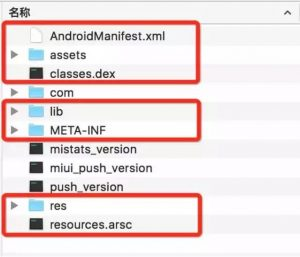
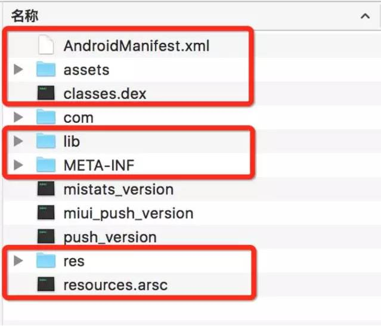
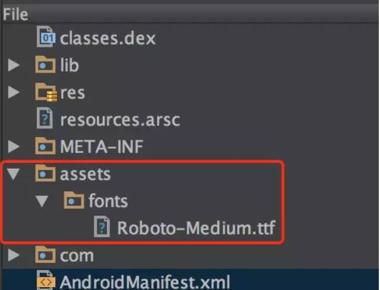
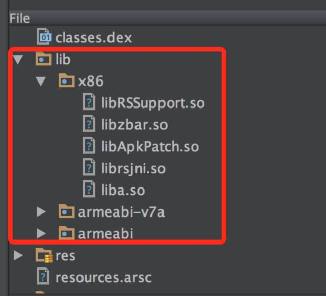
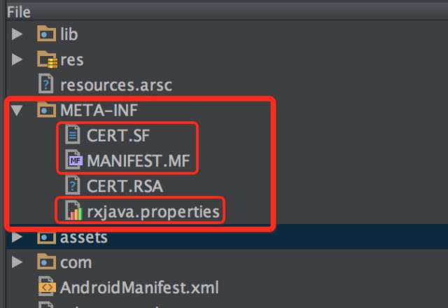

# 浅析 Android 打包流程

## Apk 的组成结构

本文脉络采用的是一个由结果反推至过程的流程。 在开始时，我们需要先弄明白，apk 文件也就是 Android 打包流程的产物，是一个什么类型的文件，它包含了一些什么内容。 弄清楚了这些，我们就可以带着目的性，去分析打包流程，可以更好的关注 apk 文件中的这些内容是在打包流程的哪个过程中产生，以及是如何产生的。
众所周知，apk 文件本质上其实是一个 zip 包。想要知道其中包含了什么，改后缀直接解压便可以看到了。 这里笔者挑软柿子，解压了某个未经过加固或者其他手段加密的 Android 安装包文件，以下为结果截图：



主要注意红色标注部分，这一些文件和文件夹是一个 Android 应用基本都具备的。而其他的一些文件和文件夹则是一些第三方库，或者是其他一些代码生成的。 接下来，依次大概介绍一下这些文件和文件夹的作用。

#### 2.1. AndroidManifest.xml

这是 Android 应用的全局配置文件，它包含了这个应用的很多配置信息，例如包名、版本号、所需权限、注册的服务等。可以根据这个文件在相当程度上了解这个应用的一些信息。该文件目前状态是被编译为二进制的 XML 文件，可以通过一些工具（如 apktool）反编译后进行查看。
这里强烈安利大家升级一下 Android Studio 2.2 Preview，其新功能 Analyze apk是一个很不错的 apk 分析(~~hack 入门~~)工具。我们可以通过它直接反编译看到原始的 AndroidManifest.xml 文件，如下图。




#### 2.2. assets 文件夹

assets 文件夹用于保存需要保持**原始文件**的资源文件夹，开发过程中拖了什么到里面，打包完之后里面还是什么。一般用于存放音频，网页（帮助页面之类的），字体等文件。主要需要知道的点是，它与 res 文件夹的区分以及如何在应用中访问该文件夹的资源，如它可以有多级目录而 res 则只有两级。




#### 2.3. dex 文件

classes.dex 文件是 Android 系统运行于 Dalvik Virtual Machine 上的可执行文件，也是Android 应用程序的核心所在。项目工程中的 Java 源码通过 javac 生成 class 文件，再通过 dx 工具转换为 classes.dex，注意到我们这里有 classes2.dex 和 classes3.dex。这是方法数超过一个 dex 的上限，分 dex 的结果。分 dex 在 Android 5.0 之前需要开发者自行完成，5.0 后 dx 自带支持。dex 文件的数据结构不算复杂。目前一些热补丁有关的技术，主要便是对 dex 做各种处理。
 

#### 2.4. lib 文件夹

该目录存放着应用需要的 native 库文件。比如一些底层实现的图片处理、音视频处理、数据加密的库以 so 库的形式在该文件夹中。而该文件夹下有时会多一个层级，这是根据不同CPU 型号而划分的，如 ARM，ARM-v7a，x86等，如下图：



#### 2.5. META-INF 文件夹

该目录的主要作用是用于保证 APK 的完整性以及安全性。该文件夹下，主要有三个文件。如下图：



先说 MANIFEST.MF，这个文件保存了整个 apk 文件中所有文件的文件名 + SHA-1后的 base64 编码值。这也就意味着，MANIFEST.MF 象征着 apk 包的完整性。再说 CERT.RSA，这个文件保存了公钥和加密方式的信息。最后说 CERT.SF，这个文件与 MANIFEST.MF 的结构一样，只是其编码会被被私钥加密。这样一来每次安装时，通过该文件夹中的文件，就可以完成验证的过程。如果 apk 包被改变了，而篡改者没有私钥生成 CERT.SF，则无法完成校验。

#### 2.6. res 文件夹

顾名思义，该文件夹是资源文件夹。它里面存放的所有文件都会被映射到 R 文件中，生成对应的资源 ID，便于代码中通过 ID 直接访问。其中的资源文件包括了动画(anim)，图像(drwable)，布局(layout)，常量值(values)，颜色值(colors)，尺寸值(dimens)，字符串(strings)，自定义样式(styles)等。

#### 2.7. resource.arsc 文件

这个文件可以说是所有文件中结构最复杂的。
它记录了资源文件，资源文件位置(各个维度的路径)和资源 id 的映射关系。并且将所有的 string 都存放在了 string pool 中，节省了在查找资源时，字符串处理的开销。

我们可以使用 Androdi Studio 2.2 Preview 中的新功能 Analyze apk （这个新功能用来分析 apk 非常好用，强烈推荐各位读者可以尝试一下）

我们可以看到，首先是有个 package 可选，实际上 resource.arsc 是可以包含多个 package 的资源的。 然后可以看到一个 Resource Types 的列表。这里看到的是 drawable 的 type。 右边显示了有多少个 drawable 以及多少项 configurations，以及表的具体内容为 ID – Name – 各个维度的值（在这里即是资源的路径)，通过这个，我们可以完成通过 id + 对应的 configuration 获取对应资源的操作。

而后面要提到资源混淆的原理，就是修改这里各个维度的值，并修改对应 res 里面的文件夹以及文件名实现的。
具体其完整的数据结构比较复杂，在这里就不展开说了，有兴趣的读者可以自行查阅信息，甚至写一个 parser 出来也是非常有意思的。

## Ⅲ Android 打包流程

在了解了 apk 文件的结构后，我们开始分析 Android 的打包流程。

#### 3.1 资源

Android 打包流程的第一步，是处理资源文件。
在这个步骤中，起主要作用的是 aapt。
刚刚提及的 AndroidManifest.xml, res 文件夹，resource.arsc 文件的生成都与其有关，简单来说，aapt 解析项目代码中的 AndroidManifest.xml，收集项目中 res 文件夹的资源文件及 xml 文件，对其做压缩以及编译的处理。在此过程中，分配了资源 id 并生成了 R.java 文件 以及 arsc 文件。

#### 3.2 代码

上一步得到了 R.java 文件后，将其与项目代码一起编译得到 .class文件，然后打包为 jar 包。这个过程中，还会有混淆代码这一步骤。之后，再通过 dx 工具，将生成的 jar 包与第三方库的 jar 包一起编译为 dex 文件。这个过程中，如果是 5.0 以前的系统且超过了 65535 方法数的限制，需要人为的分 dex，5.0 以后则由 dx 工具包办。
到这一步，实际上 apk 所需要的主要内容已经大致齐全了。只需要把上面生成的 AndroidManifest.xml，classes.dex，res文件夹，resource.arsc 打包进 apk，并且将项目工程中的 assets 以及 lib 目录一并放入，就有了一个未经签名的 Android 安装包了。

#### 3.3 签名

接下来还缺简单但是却关键的最后一步，那便是 apk 包的签名，这一步在之前对 META-INF 的介绍中，实际已有提及。只需要按步骤生成 MANIFEST.MF, CERT.RSA，CERT.SF 并放入META-INF 文件夹即可。
以上便是 Android 打包的基本流程，宏观来看实际并不复杂，但是其中的一些步骤展开来讲，却是很有内容的，比如 appt 对资源处理的那个部分，R.java 是如何生成的，resource.arsc 又是如何生成的，Android 是怎样完成对资源的获取的，这些内容笔者之后会继续整理分享。

## Ⅳ 业内有关技术小结

分析完流程之后，我们来看看目前业内有哪一些与编译有关的技术可以运用起来的。

#### 4.1 apk 加固

实际上是通过外包一层解壳 apk，将我们自己的 dex 文藏在加密 apk 的 dex 中。由于破坏了正常的 dex 结构，所以一般的反编译工具，如 apktool 并不能直接反编译 apk。但是如果了解了加密的方式以及方案，实际上要破解得到脱壳 dex 并不复杂，这只是一定程度上提高了 hack 的成本，不过针对一般的 hack 依然很有效。

#### 4.2 快速多渠道包

由于国内有着数不胜数的 Android 应用市场，所以越来越多的渠道包成为了每一个应用的必须。
在之前，开发者一般通过 AndroidManifest.xml 中的meta 信息来区分渠道。在了解了打包流程后，大家应该明白，一旦改变了 AndroidManifest.xml 就意味着要重新打包。
ts（多渠道包的时间） = t （打每个包的耗时） * n （n为渠道数量）， n 在大到一定程度后，ts 就会变得非常的大。这显然是让开发者十分痛苦的。
要解决这个问题，实际上需要攻破的是，META-INF 的完整性校验机制。
目前业界比较常用的两种方案是：

1. META-INF 下添加空文件不会破坏签名（文件名为渠道号，若 Google 更改签名机制，有可能失效）
2. apk 文件末尾写入信息（本质是利用了 zip 文件可以添加 comment 数据结构的特点）
   这两种改动方案都不会导致 MANIFEST.MF 文件的改变，也就不需要再次打包，只需要简单的读改文件即可。为广大开发者节省了上线前漫长的等待渠道包的时间。

#### 4.3 资源混淆

资源混淆通过混淆资源路径名以及资源文件名，比如：

```
res/drawable/icon -> r/s/a
```

这样不但可以减少安装包的体积，一定程度上也可以提高破解难度。
该方案目前业内也有两种实现，但是原理基本一致。入手点皆为resource.arsc。
第一种方案是修改我们刚刚提及的 aapt，使得在生成 resource.arsc 的过程中，就修改掉项目中资源的名称，实现了资源的混淆。
第二种方案则是在打出 apk 包之后，读入已生成的 resource.arsc 文件，进行混淆，改写，同时修改掉 res 文件夹下的资源名称，完成混淆。最后再重新打包得到混淆资源后的新 apk 文件。
既可以减小体积，又可以一定程度增加被 hack 的难度，如果还有没有用起来的同学，可以尝试用起来了。

#### 4.4 热补丁

由于移动平台的特性，移动应用版本的升级率并不高。这种时候，如果应用应用也可以像网页那般动态部署，无疑可以带来非常大的优势，比如在线修复 bug，小版本的升级，临时特性的上线等。
目前业界已经有比较多的技术方案了，在这里我们提及两种比较有代表性的方案。

1. 通过 native hook 的方式，替换 class 中的方法实现完成热补丁。
2. classloader 加载新 dex 覆盖原有 class 完成替换的方案。
   因为实际上每种方案都并非几句话可以讲解清楚，本文主要目的也只是做个大概介绍，读者有兴趣可以谷歌后进一步研究，这里就不具体展开讲了。
   实际上还有一些技术，比如使用 Anotation 自动生成代码，buck exopackage 提高打包速度等。有兴趣的话，可以自行查阅，相信可以学到不少知识的。